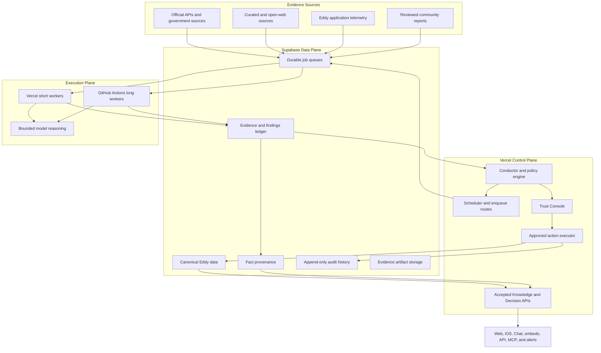
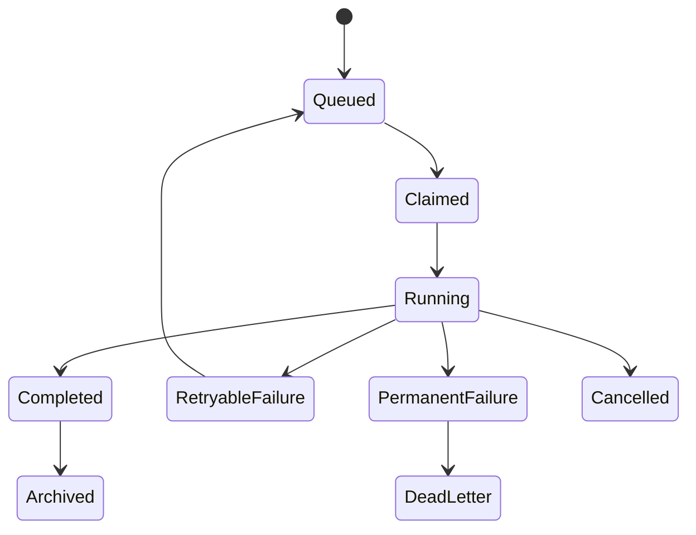

# Eddy Autonomous Operations and Intelligence Framework

> **Status:** Proposed roadmap  
> **Date:** 2026-08-03  
> **Owner:** Eddy  
> **Operating model:** Founder + Codex, bounded autonomy  
> **North star:** Trust first, followed by river intelligence, repeatable expansion, distribution, and sustainable revenue

## Executive summary

Eddy should evolve from a river-planning application with individual automations into a founder-supervised operating system that continuously:

- verifies the accuracy and freshness of river information;
- detects changes, outages, regressions, and opportunities;
- explains why a finding matters and preserves its evidence;
- stages safe, reviewable fixes;
- produces grounded river and trip recommendations;
- expands into new rivers through a repeatable evidence-driven process;
- improves distribution, partnerships, and revenue using observed outcomes; and
- feeds the same accepted knowledge into the website, iOS app, embeds, API, MCP, alerts, and public Chat.

The system can become operationally self-sustaining, but it must not become self-authorizing. Humans continue to control safety policy, canonical facts, publishing, deployments, external communication, spending, and strategic objectives.

The architecture uses Eddy's existing providers:

- **Vercel:** product, APIs, conductor, scheduler, short workers, and approved action execution.
- **Supabase/Postgres/PostGIS:** canonical data, durable queues, evidence, provenance, findings, approvals, and audit history.
- **GitHub Actions:** long-running browser QA, controlled crawling, large audits, and approved code-remediation workflows.
- **Anthropic:** bounded extraction, reconciliation, explanation, and drafting through the existing SDK.
- **Resend:** immediate alerts and daily briefs.
- **Supabase Storage:** larger evidence snapshots, screenshots, traces, and QA artifacts.

No additional hosting provider, graph database, Redis service, or general-purpose agent platform is required for the initial system.

## Product objective and governance

### Objective hierarchy

The conductor optimizes objectives in this order:

1. Paddler safety and factual trust.
2. Usefulness of trip recommendations.
3. Product reliability.
4. Coverage and distribution.
5. User growth and retention.
6. Sustainable revenue.

Lower objectives cannot override higher ones. A revenue opportunity, SEO opportunity, or engagement experiment can never weaken safety guidance or suppress uncertainty.

### Meaning of self-sustaining

The mature framework may autonomously:

- run approved checks and source monitors;
- gather and normalize evidence;
- detect and deduplicate findings;
- prioritize work using approved policies;
- draft explanations, content, patches, and experiments;
- execute explicitly allowlisted reversible actions;
- validate outcomes and retry recoverable failures;
- produce daily and weekly operating reports; and
- recommend how approved budgets should be allocated.

It may not autonomously:

- redefine Eddy's goals;
- modify its own safety or authorization policies;
- treat model output as evidence;
- publish unsupported safety facts;
- change canonical safety data without approval;
- merge or deploy code;
- send partner communications;
- commit spending outside approved limits; or
- create unrestricted workers or tools.

### Locked initial decisions

- Primary operator: solo founder.
- Implementation capacity: founder + Codex.
- Initial north star: trust.
- Autonomy posture: bounded autonomy.
- First product surface: Trust Console.
- Remediation posture: stage fixes before approval.
- Open-web posture: evidence may create findings but cannot update live facts.
- Notification posture: immediate critical alerts plus one daily email.
- Cost posture: deterministic checks first; models only where reasoning adds value.
- First Chat target: public paddler trip-planning Chat.
- First post-trust investment: River Intelligence.

## System architecture



### Control plane

The control plane lives in the existing Next.js application on Vercel. It provides schedules, job creation, worker registration, policy configuration, finding prioritization, admin authentication, Trust Console APIs, approvals, notifications, and public accepted-knowledge services.

The conductor is primarily deterministic TypeScript policy code. A model may summarize its output, but cannot decide permissions, silently lower severity, approve mutations, or change canonical facts.

### Data plane

Supabase remains Eddy's durable shared memory. Existing normalized tables remain canonical for rivers, gauges, access points, hazards, services, routes, conditions, and related product data. The framework adds evidence and provenance around those records rather than replacing them with a second source of truth.

PostGIS continues to provide geographic relationships and spatial validation. The logical knowledge graph consists of existing entities and relationships plus claim-level evidence and provenance edges.

### Execution plane

Use Vercel Functions for time-sensitive and bounded jobs. Use GitHub Actions for browser-based, large, or slower jobs.

Normal Vercel jobs should target two to three minutes even if the account permits longer execution. Every job must checkpoint and resume rather than depending on maximum function duration.

GitHub Actions handles:

- Playwright journeys and mobile screenshots;
- full page and dataset audits;
- controlled multi-page crawling;
- large regional research batches; and
- approved code-patch generation.

Critical condition freshness, closures, and production health remain on Vercel because scheduled GitHub workflows may be delayed.

## Portable framework design

### Code organization

```text
trust/
├── contracts/
│   ├── job.ts
│   ├── worker.ts
│   ├── observation.ts
│   ├── evidence.ts
│   ├── finding.ts
│   ├── action.ts
│   └── policy.ts
├── runtime/
│   ├── registry.ts
│   ├── queue.ts
│   ├── runner.ts
│   ├── checkpoint.ts
│   ├── retry.ts
│   ├── idempotency.ts
│   └── budget.ts
├── policy/
│   ├── confidence.ts
│   ├── severity.ts
│   ├── permissions.ts
│   ├── prioritization.ts
│   └── conductor.ts
├── sources/
│   ├── registry.ts
│   ├── official/
│   ├── web/
│   ├── application/
│   └── community/
├── workers/
│   ├── integrity/
│   ├── drift/
│   ├── qa/
│   ├── intelligence/
│   ├── expansion/
│   ├── growth/
│   └── revenue/
├── actions/
│   ├── database-patch.ts
│   ├── content-diff.ts
│   ├── code-patch.ts
│   ├── notification.ts
│   └── experiment.ts
└── adapters/
    ├── queue.ts
    ├── storage.ts
    ├── model.ts
    ├── scheduler.ts
    ├── notification.ts
    └── long-runner.ts
```

### Worker contract

```ts
interface TrustWorker {
  id: string;
  version: string;
  description: string;
  cadence: WorkerCadence;
  permissions: Permission[];
  budget: WorkerBudget;

  collect(context: WorkerContext): Promise<Observation[]>;
  evaluate(
    observations: Observation[],
    context: WorkerContext,
  ): Promise<TrustFinding[]>;
  propose?(
    finding: TrustFinding,
    context: WorkerContext,
  ): Promise<ProposedAction | null>;
}
```

Workers do not chat with one another. They exchange versioned jobs, observations, evidence, findings, actions, decisions, execution results, and product signals through Supabase.

### Migration boundaries

Platform dependencies stay behind adapters:

- Supabase Queues can later be replaced by SQS, Redis, RabbitMQ, or another queue.
- Supabase Storage can later be replaced by S3 or GCS.
- Vercel Cron can later be replaced by another scheduler.
- GitHub Actions can later be replaced by a container worker.
- Anthropic can be replaced per capability through a model adapter.
- Resend can be replaced through a notification adapter.

The runner should support both a CLI entrypoint for GitHub Actions and a Docker entrypoint for future Cloud Run, Render, Fly, Kubernetes, or self-hosted execution. The initial system need not host the container; preserving the contract makes a future move an infrastructure migration rather than a framework rewrite.

## Queue and job runtime

Use Supabase Queues through `pgmq`. If the extension is unavailable, implement the same adapter over a `trust_jobs` table using `FOR UPDATE SKIP LOCKED`, visibility leases, attempt counters, idempotency keys, scheduled retries, and dead-letter state.

Every job includes:

- unique ID, worker ID, and worker version;
- versioned payload schema;
- idempotency and correlation keys;
- priority and scheduled timestamp;
- attempt and maximum-attempt counts;
- visibility deadline;
- parent run ID;
- budget allocation; and
- permission scope.

### Job lifecycle



### Retry policy

- Network timeout: exponential backoff.
- Rate limit: retry using provider reset information.
- Invalid source response: retry once, then create a source-health finding.
- Model schema failure: retry once with structured repair instructions.
- Deterministic validation failure: do not retry until inputs change.
- Permission failure: do not retry; escalate.
- Canonical mutation conflict: stop and require renewed approval.
- Default maximum attempts: five.

Large jobs decompose into small units: one river per integrity job, one source page per drift job, one critical journey per QA job, and one entity or field group per proposed action.

## Evidence and operational data model

### `source_registry`

Stores source identity, authority tier, domains, supported claims, geographic coverage, retrieval method, cadence, rate limits, terms/robots notes, parser version, health, expected freshness, and failure policy.

### `trust_runs`

Records worker/version, trigger, timing, status, job and finding counts, model usage, estimated costs, cache usage, errors, retries, Git SHA, deployment version, and input snapshot.

### `evidence_items`

Stores source, URL, retrieval/effective timestamps, content hash, extracted claim, short excerpt, normalized value, entity match, geographic match, authority tier, extraction method/version, artifact reference, and next-review time.

Prefer hashes, short excerpts, structured facts, and URLs over storing complete copyrighted pages.

### `fact_provenance`

Connects evidence to a canonical entity field and records whether it supports, contradicts, supersedes, or historically explains the value. It also records acceptance state, reviewer, verification time, freshness deadline, and confidence contribution.

### `trust_findings`

Stores a stable fingerprint, category, entity/field, title, explanation, observed and expected values, severity, confidence breakdown, affected surfaces, safety relevance, first/last observed times, recurrence, status, owner, snooze deadline, resolution, and relationships.

Finding states:

- open;
- investigating;
- awaiting evidence;
- awaiting review;
- approved for action;
- resolved;
- rejected; and
- snoozed.

### `finding_evidence`

Provides the normalized many-to-many relationship between findings and evidence.

### `proposed_actions`

Stores finding, action type, target, before-state hash/snapshot, proposed after-state, structured patch, explanation, risk, permission, preconditions, post-validation, rollback, approval, execution, and result.

Action states:

- draft;
- staged;
- awaiting approval;
- approved;
- executing;
- applied;
- validation failed;
- rolled back;
- rejected; and
- superseded.

### `trust_events` and `notification_deliveries`

Maintain append-only state changes, decisions, policy/configuration changes, executions, rollbacks, delivery attempts, deduplication keys, cooldowns, acknowledgments, and resolutions.

## Confidence, severity, and prioritization

### Confidence

Use a transparent 0–100 score with default components:

- source authority: 30 points;
- independent corroboration: 20 points;
- freshness: 15 points;
- entity and geographic match: 15 points;
- extraction certainty: 10 points; and
- consistency with trusted context: 10 points.

Penalize contradictory authoritative evidence, copied sources, stale evidence, weak matching, inferred claims, parser uncertainty, and evidence originating only from user-generated content.

A single authoritative source can establish an urgent official closure. Community corroboration can increase urgency but cannot automatically change canonical safety facts.

### Severity

**Critical:** dangerous or stale condition data, missing authoritative closures, incorrect immediate safety guidance, core outages, exposed sensitive data, or total failure of critical monitoring.

**High:** incorrect access legality, materially wrong route calculations, gauge miswiring, broken planning workflows, major embed outages, or contradictory authoritative evidence.

**Medium:** stale business information, missing provenance, non-critical broken pages, incomplete amenities, or meaningful content/SEO drift.

**Low:** cosmetic inconsistencies, optional metadata, weak internal links, or minor copy improvements.

### Prioritization

Rank by severity, safety impact, confidence, affected users/surfaces, age, recurrence, remediation reversibility, and dependencies. An unresolved critical finding caps overall health and cannot be averaged away by healthy low-risk records.

## Autonomy and security

### Automatic

Workers may read canonical data, fetch configured sources, run checks, store evidence, create/deduplicate findings, generate proposals, send approved operational notifications, and archive operational records.

### Approval required

Require founder approval for canonical changes, safety guidance, access legality, hazards, gauge thresholds, public content, code changes, PR creation, deployment, partner communication, paid placement, spending changes, worker permissions, and source-authority changes.

### Execution controls

- Public clients cannot access internal evidence, queues, or actions.
- Admin mutations use existing admin authentication.
- Vercel retains canonical database credentials.
- GitHub Actions receives an opaque job ID and narrowly scoped HMAC credential, not the Supabase service-role key.
- GitHub retrieves work and posts structured results through internal Vercel endpoints.
- Approved canonical actions execute only through typed Vercel handlers.
- Changed before-state invalidates approval.
- Mutations are transactional where possible and require post-validation.
- Failed validation triggers rollback or a critical remediation finding.

### Crawler safety

Treat every page as adversarial input. Strip active content, ignore embedded instructions, prevent crawled text from selecting tools, parse into bounded schemas, validate redirects and response sizes, detect prompt injection, preserve source/timestamp, and keep discovery separate from acceptance.

## Operator experience

### Trust Console

Add one Trust section to Eddy Admin with:

- overall health and critical status;
- findings by severity and state;
- freshness and provenance coverage;
- source, worker, and queue health;
- pending approvals and recent resolutions;
- model and crawler usage;
- filters by river, entity, source, confidence, safety relevance, and age;
- evidence timelines and confidence explanations;
- before/after patches, preconditions, validation, and rollback; and
- approve, edit, reject, snooze, investigate, and resolve actions.

### Daily brief

Send once at 7:00 AM America/Chicago. Run the dispatcher hourly and use a local-time/idempotency guard so daylight saving time does not duplicate or skip delivery.

Include overall health, new critical/high findings, approvals, resolutions, failed workers/sources, repeated issues, recommended work, estimated review time, and direct admin links.

### Immediate alerts

Alert immediately for dangerous or stale condition data, authoritative closures, critical contradictions, core outages, or total failure of a critical monitor. Deduplicate by fingerprint, enforce cooldown, escalate unresolved problems, and send resolution notifications.

### Review cadence

- Daily: critical/high findings and approvals.
- Weekly: false positives, recurring failures, and worker value.
- Monthly: source authority, costs, and coverage gaps.
- Quarterly: objective portfolio, budgets, and autonomy changes.

# Multi-phase delivery roadmap

## Phase 0: Architecture and baseline — weeks 1–2

### Work

- Verify `pgmq` availability.
- Inventory validators, syncs, admin endpoints, cron jobs, telemetry, and reusable scripts.
- Classify existing code as checks, source adapters, actions, or legacy utilities.
- Define all versioned contracts and the worker registry.
- Establish source authority tiers and feature flags.
- Baseline gauge freshness, API reliability, data coverage, maintenance time, and known gaps.
- Document canonical versus derived fields.

### Gate

A no-op worker can enqueue, claim, checkpoint, complete, and archive without duplicate results or production mutations.

## Phase 1: Trust ledger and runtime — weeks 2–4

### Work

- Add trust schema and RLS.
- Implement queues, runs, evidence, findings, provenance, actions, events, and notifications.
- Implement leases, retries, dead letters, idempotency, checkpoints, and budgets.
- Implement confidence, severity, deduplication, and conductor v1.
- Add read-only admin APIs and usage accounting.

### Gate

Retries cannot duplicate findings; every artifact is versioned and attributable; public access is blocked; and model usage is assigned to a worker and run.

## Phase 2: Data Integrity worker — weeks 4–7

### Initial checks

- Missing, stale, future, or implausible gauge readings.
- Wrong provider, gauge, river, or section association.
- Missing/contradictory units, thresholds, danger levels, or provenance.
- Missing, sparse, reversed, disconnected, or implausible river geometry.
- Missing active-river knowledge or unsupported hydrology.
- Off-river, duplicate, misordered, or legally contradictory access points.
- Impossible segment distance, duration, or gauge boundary.
- Hazards without usable locations or with expired temporary status.
- Duplicate services, broken official URLs, and unsupported high-impact claims.

### Gate

Ten to fifteen high-value checks run reliably, findings deduplicate, explanations are evidence-backed, and the worker has no canonical write permission.

## Phase 3: Data Drift worker — weeks 5–8

### Coverage

Official sources include USGS, NWS, NPS, USFS, government GIS, and existing government recreation/closure feeds. Web discovery includes configured outfitters, campgrounds, tourism organizations, river sources, and targeted search results.

### Cadence

- Critical official feeds: every 15–60 minutes.
- Closures and alerts: hourly.
- Stable government pages: daily.
- Outfitter/service pages: weekly.
- Broad discovery: weekly.

### Gate

Changes produce deduplicated findings; copied sources are not independent; web evidence cannot update canonical values; parser failures do not imply changes; critical official changes meet their SLA.

## Phase 4: QA and Embed Health worker — weeks 6–9

### Vercel checks

Continuously test health, rivers, conditions, planning, weather, search, Eddy updates, embeds, critical assets, OG routes, response schemas, latency, and freshness.

### GitHub Actions checks

On deployments and daily, run homepage, river selection, river detail, access selection, plan creation, sharing, mobile rendering, embeds, OG images, links, accessibility assertions, and eventually public Chat. Save screenshots and traces on failure.

### Gate

Critical journeys are covered, artifacts accompany failures, flaky checks are separated from outages, and time-sensitive monitoring does not depend on GitHub schedules.

## Phase 5: Console, alerts, and staged fixes — weeks 7–10

### Work

- Complete the Trust Console and evidence detail.
- Add approval workflows and proposed-action previews.
- Implement daily and immediate notifications.
- Implement typed database patches and content diffs.
- Generate code-patch artifacts, requiring separate approval before opening a draft PR.
- Enforce preconditions, transactions, post-validation, rollback, and event logging.

### Gate

The founder can understand findings without logs, every patch exposes before/after state, stale approvals invalidate, failed validation rolls back or escalates, and no worker can merge, deploy, or publish.

## Phase 6: Shadow operation and calibration — weeks 10–12

Run all trust loops without automated canonical execution. Review all critical/high findings and sample lower severities. Tune confidence, authority, severity, cadence, and notification policies. Simulate stale dangerous-water data and backlog recovery.

### Trust MVP gate

- Four weeks of real operation.
- Fewer than 20% false positives among reviewed findings.
- At least two hours of manual work saved weekly.
- Critical condition failures detected within 15 minutes.
- Manageable solo-founder queue.
- Every safety-critical field sourced or explicitly unknown.
- No unauthorized mutations.
- Reliable queue recovery and notification delivery.

If these conditions fail, improve trust rather than expanding the agent portfolio.

## Phase 7: River Intelligence — months 3–5

Build one `RiverDecisionService` that answers whether a person should float a river, section, and time.

### Inputs

River candidates, section, date/time, conditions and trend, weather, alerts, hydrology, hazards, closures, access, experience, vessel, group type, desired duration, crowd preference, and trusted distance context.

### Outputs

Go/no-go, ranked choices, confidence, freshness, supporting and contradicting evidence, audience fit, recommended window, limitations, alternatives, reason codes, and Eddy narrative.

Deterministic logic controls staleness, thresholds, closures, dangerous-water rules, alerts, hydrology support, completeness, and hard audience restrictions. Models explain and compare the resulting safe choices.

Launch “Best float today” first, followed by river pages, planning, alerts, embeds, API, MCP, and Chat.

### Gate

No unsafe scenario passes evaluation; at least 80% of sampled ordinary recommendations need no material correction; every result exposes freshness and uncertainty; all surfaces agree; users demonstrate meaningful engagement.

## Phase 8: Public Chat integration — months 4–6

Chat consumes accepted canonical data, accepted provenance, current conditions, and `RiverDecisionService`. It cannot read unresolved findings, rejected evidence, internal artifacts, proposed actions, or admin notes.

Tool results add timestamps, freshness, confidence, sources, contradiction state, safety state, and support status. Stale or contradictory safety data produces conservative uncertainty. User questions may create anonymized product signals but never canonical facts.

Roll out through conversation replay, founder preview, limited public exposure, monitoring, and gradual expansion.

## Phase 9: Repeatable expansion — months 5–8

Create a versioned `RiverPackage` covering identity, region, timezone, geometry, sections, hydrology archetype, providers, gauges, thresholds, access, hazards, miles, route calibration, weather/alerts, knowledge, regulations, sources, cadence, confidence, gaps, and launch state.

Support spring-fed, rain-responsive, mixed, tailwater/regulated, large-mainstem, and explicitly unsupported archetypes. New archetypes require reviewed semantics and evaluations.

The Expansion worker may identify candidates, scaffold dossiers, find sources/gauges/access candidates, validate geometry, estimate gaps, stage packages, and generate readiness reports. It may not activate rivers.

### Gate

Normal onboarding uses configuration rather than product-code changes, takes fewer than two engineering days, shows declining research effort, passes identical trust gates, and isolates source failures to the affected adapter/package.

## Phase 10: Distribution, SEO, Content, and Community — months 8–10

### Growth

Analyze search-to-river selection, planner conversion, abandonment, saves, subscriptions, recommendations, embeds, referrals, and retention. Stage experiments with a hypothesis, primary metric, guardrails, duration, sample needs, implementation, and rollback.

### SEO and Content

Detect schema, title, duplication, orphaning, FAQ, linking, staleness, demand, and missing-page opportunities. Draft river reports, guides, notices, FAQs, itineraries, facts, partner spotlights, and social content from accepted knowledge. Require review before publication.

### Community

Use Eddy feedback, reviewed reports, repeated Chat questions, search queries, and permitted public sources to identify questions, hazards, missing guides, confusing language, and data gaps. Community signals remain evidence candidates until corroborated or moderated.

### Gate

Public drafts use accepted knowledge, experiments declare metrics and guardrails, growth cannot alter safety ranking, community input follows moderation, and work demonstrates measurable value.

## Phase 11: Mapping and Forecast moats — months 9–14

Mapping continuously validates river lines, access roads, parking, ramps, bridges, private boundaries, miles, connectivity, hazards, and provider drift. Imagery-derived conclusions remain proposals until reviewed.

Forecast predicts 24–72 hour conditions using trends, rainfall, drainage area, archetype, historical response, percentiles, temperature, dam schedules, and uncertainty. Output includes expected range, confidence interval, horizon, freshness, support status, and primary drivers.

Forecast launch requires historical backtesting, river-specific errors, dangerous-underprediction testing, conservative uncertainty, and a clear separation between observed and predicted values.

## Phase 12: Revenue and Partnerships — months 10–18+

Analyze premium demand, alerts, forecast engagement, referrals, partner gaps, high-demand regions, embeds, seasonality, and API usage. Test one offer at a time: premium alerts, extended forecasts, saved-trip monitoring, referrals, featured services, tourism integration, partner analytics, paid API access, or sponsorship.

The Partnership worker may identify candidates and stage evidence, value propositions, outreach, and expected impact. It may not send outreach.

Paid placement must be labeled, organic recommendations remain safety/relevance based, partners cannot purchase safer labels, and revenue cannot suppress negative safety information.

## Phase 13: Bounded self-sustaining operations — month 12+

Each quarter, the founder approves objectives, budgets, permissions, and deferred work across trust, product, expansion, distribution, and commercial domains.

The mature conductor maintains the backlog, resolves dependencies, estimates cost/value, allocates approved budgets, schedules recurring work, tracks outcomes, deprioritizes repeatedly rejected work, escalates safety issues, and suggests capabilities only when repeated needs justify them.

A weekly operating proposal includes trust state, completed work, findings, approvals, product recommendations, expansion candidates, experiments, partnerships, costs, founder review time, and blockers.

## Long-term worker domains

The original agent list consolidates into four domains plus the conductor:

- **Trust:** Data Integrity, Data Drift, QA, mapping validation, and Embed Health.
- **River Intelligence:** conditions, recommendations, forecasts, safety interpretation, and planning assistance.
- **Experience and Distribution:** Growth, SEO, Content, Community, and experiments.
- **Business:** Revenue, Partnerships, regional opportunities, and partner health.
- **Conductor:** prioritization, dependencies, policy, scheduling, budgets, briefs, and outcomes.

Create a separate worker only when a capability has distinct sources, tools, cadence, permissions, evaluation, and sufficient recurring workload.

## Testing strategy

### Unit

Test confidence, source independence, severity, fingerprints, deduplication, recurrence, notification cooldowns, queue leases, idempotency, permissions, preconditions, local-time dispatch, and model-output validation.

### Integration

Use fixtures for stale gauges, misassociation, off-river access, duplicates, impossible mileage, legal contradictions, closures, conflicting sources, parser failures, restored sources, broken APIs, failed embeds, and outage recovery.

### Adversarial

Test prompt injection, malicious metadata, redirects, oversized responses, copied corroboration, false closures, hallucinated evidence, poisoned entity names, unsafe stale-data recommendations, and permission escalation.

### End to end

Verify schedule, queue, worker, finding, evidence, notification, review, approval, preconditions, transactional action, validation, audit, and rollback as one workflow.

### Reliability

Test duplicate delivery, mid-job termination, expired leases, backlogs, rate limits, GitHub delays, model outages, Supabase failures, notification failures, and rollback failures.

## Metrics and phase gates

### Trust

Provenance and freshness coverage, detection latency, false positives, review/resolution time, recurrence, source/worker success, queue age, and manual hours saved.

### Intelligence

Safety pass rate, operator acceptance, recommendation engagement, planning lift, feedback, cross-surface consistency, honest unsupported responses, and cost per decision.

### Expansion

Engineering/research time per river, validation failures, source coverage, post-launch issues, maintenance cost, and percentage requiring custom code.

### Distribution and business

Organic traffic, plan conversion, embed uptime, partner usage, experiment win rate, retention, premium/referral conversion, revenue per region, API usage, and revenue relative to maintenance cost.

### Operations

Worker spend, tokens/cache, founder review time, action approval and rollback rates, dead-letter rate, and competing recurring workloads.

No phase advances merely because its code is finished. It advances only when operating metrics justify the next investment.

## Rollout and failure controls

Every worker, source, action type, and notification category receives an independent feature flag.

Progressive activation:

1. Development fixtures.
2. Non-production environment.
3. Production shadow mode.
4. Founder-only findings.
5. Notifications.
6. Staged fixes.
7. Approved execution.
8. Explicitly allowlisted low-risk autonomy, if earned.

Emergency controls let the founder pause queues, disable workers/sources/models/notifications/actions, revoke GitHub ingestion, roll back approved actions, and place the system in read-only incident mode.

## Explicit deferrals

Do not build in the initial Trust MVP:

- a separate graph database;
- Redis or another queue provider;
- a new worker-hosting vendor;
- a general-purpose agent mesh;
- free-form agent-to-agent conversations;
- continuous broad-web crawling;
- autonomous PR creation or publication;
- automatic safety-data changes;
- sophisticated forecast models;
- portfolio budget allocation;
- self-modifying prompts or policies;
- a founder operations chatbot; or
- full multi-state expansion.

Each deferred capability has a later phase and must be earned through measured need.

## Final target state

At maturity, Trust workers maintain reliable facts; Drift workers detect real-world changes; QA workers protect every surface; Intelligence workers produce useful trip decisions; Expansion workers package new rivers; Growth and Content distribute knowledge responsibly; Community identifies real needs; Mapping and Forecast create differentiated capabilities; Revenue and Partnerships identify sustainable opportunities; and the Conductor coordinates all work within human-approved policy and budgets.

The website, iOS app, embeds, API, MCP, alerts, and Chat consume the same accepted knowledge and decision services.

The long-term moat is not the number of agents. It is Eddy's accumulated, time-aware, evidence-backed river knowledge and the outcome data showing which recommendations genuinely helped paddlers make better decisions.
