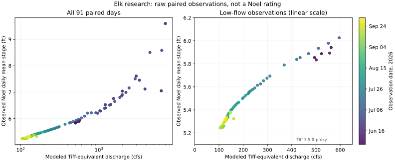

# Elk release review — 2026-10-04 UTC

**Decision: keep Elk inactive.** The listing and geography cleanup is prepared;
Noel calibration and verified launch-to-landing routes remain release blockers.
This review covers Elk only. It does not launch Big Sugar, Little Sugar or Indian
Creek. No production changes were made during this review.

## Tiff chart and Noel transfer pilot — owner evidence follow-up

### Review follow-up: observational support and next evidence



The plot uses raw paired daily observations, with color showing date; it does
not plot the fitted isotonic curve as evidence of a physical pool. Reproduce
with `--plot scripts/ingestion/elk-noel-flow-diagnostic-2026-10-04.svg` appended
to the research command below (requires matplotlib). The script now emits the
dates, count and observed stage range within ±10% of each candidate flow:

| Tiff mark (ft) | Nearby days | Observed Noel daily stage range (ft) |
| --- | --- | --- |
| 2.5 | 0 | None |
| 3.5 | 3 | 5.790–5.854 |
| 4.5 | 3 | 6.205–6.295 |
| 5.0 | 3 | 6.511–6.759 |
| 6.0 | 2 | 6.994–7.161 |
| 6.5 | 3 | 7.454–7.610 |

These ranges describe observations in a flow neighborhood, not confidence or
prediction intervals. Days from one hydrograph are not independent events;
event identities still need review before describing independent support.
The lowest paired daily mean is **5.243 ft**. Median stages in modeled-flow
bins 0–150, 150–250, 250–350 and 350–450 cfs are **5.305, 5.498, 5.653 and
5.838 ft**, respectively. This does not show the proposed fixed floor at
5.5–6 ft or establish that Noel cannot resolve the opening region. It also
does not rule out dam/backwater influence or establish recreational cutoffs.
High-water thresholds remain unvalidated too.

**Scope correction:** Trestle → Wayside IS the Noel/lower trip and remains
part of the proposed above-dam release. Only Kozy → Trestle and Kozy → Wayside
share the chart's 3.5–6 ft outer limits; craft restrictions still differ.
Do not apply that band to all three trips on the premise that Noel is excluded.

**Operator call checklist — prepared, no contact made:** Elk River Floats,
417-475-3230, as listed on its river-levels page. Ask:

1. Since Tiff stopped reporting in April, what gauge or on-site observation
   determines each trip's launch choice and craft restrictions?
2. When were the published Tiff limits established, and have they changed?
   Does the chart's 2023 upload reflect the original calibration date?
3. Can they supply dated decisions for low-water upper-trip closure/reopening,
   normal operations and high-water restrictions, with trip, craft, time and
   gauge/observation used? Record the decision reason; a weather/business
   closure is not evidence of a river-level cutoff.
4. Does Noel's bridge reading vary meaningfully during low water, and do they
   observe effects from Shadow Lake pool level or dam changes?
5. Confirm the actual Kozy, Trestle and Wayside water-entry banks, road
   entrances and current personal-boat access/parking arrangements.

USGS follow-up should confirm the station's hydraulic control/backwater
setting and whether discharge measurements or a rating are planned. Operator
practice is practical trip evidence, not a substitute for that station record.
No additional model complexity or production threshold changes are warranted
before this evidence is available. Cleanup can merge independently; its
migration is now explicitly listed under `[pending]` in the ledger.

The supplied chart is the operator's [Tiff gauge key](https://www.elkriverfloats.com/wp-content/uploads/sites/3100/2023/02/Elk-River-Gauge-Key.pdf).
Its limits depend on **trip and craft**, rather than defining a single optimal
or dangerous band for the entire Elk. The operator's “lower” trip means
**Trestle Park → Wayside**, still above the Noel dam; it does not mean below-dam
Elk. The supplied descriptions establish Kozy → Trestle, Trestle → Wayside and
the combined Kozy → Wayside trip. The lower reach's advertised year-round
availability is an operator description, not proof of every day's floatability.

We tested an indirect transfer despite there being no direct Noel/Tiff overlap.
These are **research estimates of daily mean Noel stage**, not approved live
thresholds, measured Noel discharge, or a USGS Noel rating:

| Tiff chart mark (ft) | Tiff archived rating (cfs) | Modeled Noel daily mean (ft) | Meaning on the operator chart |
| --- | --- | --- | --- |
| 2.5 | 93.07 | Not estimated: outside the observed model range | Lower trip adds rafting above this mark; canoe/kayak listed below it |
| 3.5 | 409.51 | 5.83 | Upper and full-length trips become available; lower trip adds tubing |
| 4.5 | 1,018.71 | 6.28 | Canoe participation becomes adults-only |
| 5.0 | 1,445.43 | 6.58 | Canoeing stops; upper/full kayaks limited to experienced adults; lower kayaks adults-only |
| 6.0 | 2,433.72 | 7.17 | Upper and full-length trips close; lower kayaks limited to experienced adults, rafting listed |
| 6.5 | 3,025.68 | 7.42 | Lower trip lists adults-only rafting; no all-river maximum is stated |

The full-length trip only lists canoes/kayaks throughout; shorter-trip raft or
tube availability must not be applied to it. Chart band edges are transcribed
operating guidance, not a formal specification of inclusive/exclusive bounds.

### Reproducible calculation and its limits

Run the read-only [research script](research-elk-gauge-transfer.py) with Python,
NumPy, pandas and scikit-learn:

```sh
python scripts/ingestion/research-elk-gauge-transfer.py --cache-dir /tmp/elk-transfer
```

1. Use USGS daily mean discharge at Tiff, Big Sugar/Powell, Little
   Sugar/Pineville and Indian/Lanagan. Exclude qualified records (including
   estimates); retain unqualified provisional records without treating them as
   approved. Fit log Tiff flow from the three log tributary flows on **727 days
   in 2023–2024**. Keep the model fixed for the later work.
2. Test against **383 withheld days in 2025–April 2026**. Median absolute flow
   error is **10.03%**; the 90th percentile is **21.88%**. This tests the
   historical Tiff flow prediction, not the Noel stage conversion.
3. Apply that model during Noel's record to obtain a **modeled Tiff-equivalent
   flow**. Join **91 local calendar days** of Noel stage with at least 90
   unqualified observations per day, then fit a monotonic stage relationship.
   This is an indirect proxy across periods and locations; the raw tributary
   sum would omit 28% of Noel's drainage area.
4. A chronological Noel test (June–July fit; August–October holdout) has
   **zero of 41 test days within the training flow range**. It therefore does
   not establish future-season performance. A separate leave-14-day-block-out
   interpolation check scores 86 days, excludes five outside each fit range,
   and gives **0.102 ft mean absolute error**, **0.143 ft 90th-percentile error**.
   It includes a **1.52 ft overprediction** on June 8 and a **1.20 ft
   underprediction** on June 23. Small typical errors do not bound event errors.
5. Convert the chart's Tiff stages using the retrieved [Tiff expanded rating](https://waterdata.usgs.gov/nwisweb/get_ratings?site_no=07189000&file_type=exsa),
   then evaluate the final Noel curve to generate the table. The retrieved
   rating is **31.0**, with a shift beginning **2026-04-14**, rather than a
   confirmed rating from the chart's 2023 publication. Changes in the Tiff
   stage/discharge relationship are an additional transfer uncertainty.

Inputs come from the public [USGS OGC API](https://api.waterdata.usgs.gov/ogcapi/v0/collections/).
The script records the exact series IDs and date ranges, rejects incomplete
pagination and duplicate timestamps, and emits JSON without writing to Eddy.
Raw responses are cached outside the repository. Retrieval and analysis date:
2026-10-04; source ranges end 2026-10-03 and include provisional observations.

**Next calibration check:** compare these candidate marks with dated operator
trip/craft decisions at Noel, and assess subdaily rising/falling events and
travel time using the tributary series. Daily averaging cannot validate
instantaneous opening/closure levels. Do not insert these candidates into
`river_gauges` or collapse the trip-specific chart into one river-wide ladder.

### What the supplied maps resolve

The owner's six supplied images were visually inspected, including the final
satellite overview with trip endpoint markers. They corroborate the three
advertised route relationships and narrow the bank locations:

- **Kozy:** the Google Maps card displays **36.588894, -94.389059** at the land
  approach. The image shows the track toward the river. Record this as supplied
  approach evidence; it is not yet an exact water-entry coordinate.
- **Trestle:** the selected cabins/property pin is distinct from the float
  launch beach beside the Elk Springs Road low-water crossing. The satellite
  route marker and operator campground map identify that beach as the intended
  trip interchange. Do not reuse the cabins pin as the planner endpoint.
- **Wayside:** the route ends by the campground beach near the highway junction,
  corroborating the operator's designated watercraft beach above the dam. Use
  that bank, not the downstream peninsula tip or The Spot's below-dam location.
- **Combined trip:** the marked overview agrees with Kozy → Trestle → Wayside.
  It supplies practical route evidence; it does not establish a route through
  Shadow Lake Dam. Exact Trestle/Wayside bank coordinates and road entrances
  still need to be placed and reviewed against the river geometry.

No private endpoint approvals, live thresholds or river activation were changed
on the strength of these research estimates or screenshot coordinates.

## Researched release options — follow-up, 2026-10-04

The initial review treated three unresolved items as a single reason to hold the
whole river. They are separate decisions. We can limit the first planner release
to the established corridor above the dam, and can consider an explicitly
unrated release while recreational calibration is completed. These are proposed
product choices, not approval to bypass the existing activation gate.

### Gauge choices

| Option | What users receive | Work / limitation |
| --- | --- | --- |
| **Noel in feet, calibrated with local evidence** | Measured mainstem stage plus Eddy condition ratings | Obtain Noel-specific trip observations and operator limits, including craft and reach; match dated observations to USGS history. No discharge conversion is required. Best route to a fully rated launch |
| **Measured stage, unrated initially** | Live Noel hydrograph, readings/trend, access, camping, POIs and verified trips; no Too Low/Good/Optimal badge until calibrated | Build an explicit unrated mode across DB condition RPCs, web/iOS, planner estimates, recommendations and agent responses; make readiness permit that declared mode. Fastest independent release path, but not a fully rated launch |
| **Upstream discharge model** | An explicitly modeled flow estimate after validation | The pilot above yields candidate Noel stage marks from overlapping tributary histories. Historical flow backtesting is promising, but event errors, limited seasonal coverage and daily averaging prevent using it as an approved instantaneous ladder |

Additional USGS checks went beyond the continuous-series catalogue:

- [Noel discharge field measurements](https://api.waterdata.usgs.gov/ogcapi/v0/collections/field-measurements/items?monitoring_location_id=USGS-07188925&parameter_code=00060&limit=100&f=json)
  returned **zero** features.
- [Noel field-measurement metadata](https://api.waterdata.usgs.gov/ogcapi/v0/collections/field-measurements-metadata/items?monitoring_location_id=USGS-07188925&limit=100&f=json)
  returned only reference gage height, dated June 2–August 24, 2026.
- [Noel expanded rating](https://waterdata.usgs.gov/nwisweb/get_ratings?site_no=07188925&file_type=exsa)
  returned **zero files**. This establishes no publicly retrievable rating in
  that endpoint, not that USGS could not have unpublished work.
- The legacy measurement URL redirects to the modern monitoring page; that
  redirect was not treated as proof of absent measurements.
- USGS metadata for **07188653 Big Sugar/Powell**, **07188838 Little Sugar/Pineville**
  and **07188885 Indian/Lanagan** all contains continuous `00060` series through
  October 3. Their drainage areas are 141, 195 and 239 square miles: **575 sq mi**
  combined versus Noel's **801**. A raw sum omits about **28%** of the Noel basin
  and is not measured Noel discharge. Do not publish the sum as a gauge reading.

Reproduce the tributary checks using the same USGS `monitoring-locations` and
`time-series-metadata` endpoints in the identifiers file, substituting the three
site IDs. This model route is possible to investigate despite the lack of direct
Noel–Tiff overlap; the earlier statement ruled out the direct overlap method,
not every possible hydrologic model.

Code review found a concrete unrated-mode requirement:
`shared/condition-ladder.ts::classifyReading` falls through to `too_low` when all
anchors are null. `src/lib/conditions.ts::computeConditionFromDbRow`, used by the
planner fallback, does not check `hasLadder`. Simply clearing thresholds would
therefore be incorrect. Fix the behavior and explicit readiness contract before
offering the unrated option; do not fill dummy thresholds to satisfy the gate.

For a fully rated release, the shortest external evidence request is to Elk
River Floats, **417-475-3230**: which gauge now governs operations, low/normal/
high/closed levels on **07188925**, and dated examples for the upper versus Noel
trips and different craft. For the provider question, the station's legacy page
routes to Oklahoma support; the [USGS Oklahoma–Texas center](https://www.usgs.gov/centers/oklahoma-texas-water-science-center/connect)
lists **otpublicinfo@usgs.gov**. Ask whether discharge is planned, whether a
rating/measurements are available, and whether Shadow Lake backwater affects
interpretation at this location. No messages have been sent.

### Access and route choices

| Initial planner scope | What is established | Remaining specific work |
| --- | --- | --- |
| **Public-access minimum: Pineville → Mount Shira** | Two agency-listed endpoints; approximately 7.5 Eddy miles, above the Noel dam | Final route/directions review; does not need private launch permission. Narrower than the desired full Noel launch |
| **Recommended core: Pineville through Noel, ending at Wayside** | Operator publishes Kozy → Trestle (seasonal 6 mi), Trestle → Wayside (6 mi), Kozy → Wayside (12 mi, canoe/kayak only); paid personal-boat access is published | Place/review Kozy, Trestle and Wayside bank pins and separate road entrances. Keep Cowskin and below-dam endpoints out of planner eligibility for this first scope |
| **Add lower Elk as a separate corridor** | The Spot advertises a paid boat launch and personal-boat shuttle; Cowskin is public | Confirm The Spot → Cowskin service and exact below-dam bank. Enforce corridor separation server-side before approving both upper and lower endpoints |

This removes a portage investigation from the core launch: **do not offer a
cross-dam trip**. Hiding Cowskin from one picker is insufficient; leave it
ineligible in the shared endpoint resolver's data until the separate corridor
rule exists. It can remain an access listing. Full lower-Elk coverage is a later
increment, not a prerequisite to the popular above-dam routes.

The private locations have better primary-source evidence than the first review
communicated:

- **Trestle:** the operator's [campground page](https://trestlepark.com/elk-river-campground)
  and [property map](https://img1.wsimg.com/isteam/ip/4c611e4a-7b28-4d91-afd7-9f1102df1c5e/A03155FD-7BDD-4057-AC0A-4D251F844CB9.jpeg)
  show the beach beside the Elk Springs Road low-water crossing, office and
  campground road. Use that beach/access area for bank-pin review, not the
  website's generic cabin/property coordinate.
- **Wayside:** the [campground page](https://waysidecamp.com/camping) and
  [property map](https://img1.wsimg.com/isteam/ip/d1802747-9892-43c9-a0c8-d379822f4274/WS%20Map.jpeg)
  identify the permitted swim/watercraft beach, office near the highway junction,
  and downstream no-watercraft boundary before the dam. The site map requires
  designated beach access; it does not permit launching from every campsite.
  Verify the landing at that beach, not the downstream tip of the peninsula.
- **Kozy:** [operator trip descriptions](https://trestlepark.com/float-trips)
  establish it as the upper put-in. Its exact launch bank is the least resolved
  of these three; the business address alone does not locate that bank.
- **Personal boats:** [Trestle's rates page](https://trestlepark.com/rates)
  publishes a **$20/person single-location drop pass** and **$30/person two-park
  put-in/take-out pass**, subject to its stated access hours/weekend limits.
  Permission is therefore not wholly unknown; confirm the selected locations
  and parking/shuttle arrangements. Prices are page-listed, checked on this
  review date, not guaranteed future charges.
- **Below the dam:** [The Spot](https://lowerelkriveradventures.com/) lists a
  **$10 launch** and **$35 personal-boat shuttle**, but does not name Cowskin as
  the other endpoint. That pair is a concrete candidate, not an established
  bookable route yet.

The operator maps were visually inspected. They resolve the intended bank areas
and trip relationships, but are schematic rather than georeferenced. No
survey-grade latitude/longitude was inferred from them or marked approved.

**Recommendation:** finish the three core private pins and release only the
above-dam corridor first. Pursue Noel-in-feet calibration for the complete rating
experience; offer an explicit unrated initial release if operator evidence is
not available promptly. Do not make a flow model or a dam portage prerequisites.

## Coverage and prepared changes

| Area | Production inspected | Prepared in this batch | Still needed |
| --- | --- | --- | --- |
| Gauge | Inactive Tiff City primary; Noel exists but is not linked | Correct dossier to the live Noel candidate; archive historical Tiff values without transferring them | Noel-specific recreational thresholds, owner signoff, primary link and curated polling |
| Access | Six records; five approved endpoints, including two unsupported bridge pins | Keep Pineville, Mount Shira and Cowskin; withdraw I-49 and MO-59 bridge endpoints; correct Lanagan to Indian Creek | Operator landing/launch pins, permissions, road entrances and parking |
| Camping / services | Seven linked businesses, no structured route facts | Update seven; add Trestle Park, Sycamore Landing and The Spot; source field changes and booking links | Check exact campsite/launch relationships and photographs; no campsite availability feed is connected |
| Trips | One section describes a continuous Pineville–Cowskin route | Correct section narrative; record 12 advertised route entries across five operators, including repeated branded trips | Validate actual endpoint pairs and prevent unverified dam-crossing itineraries |
| POIs | None | Two USGS-mapped confluences: Elk formation and Indian Creek | No additional mainstem attraction verified for insertion |
| Springs | None | Research recorded below; no invented spring stops | Add only when an identifiable mainstem location and any landing permission are established |
| Eddy / photos | No Elk knowledge section; some access images belong to other locations | Add Elk knowledge; remove borrowed bridge photos and Pineville's restricted-use MDC image | Review remaining/new imagery and river-page presentation before activation |

Prepared files: `services-elk-release-2026-10-04.csv`, its `.diff.txt` preview,
`service-river-facts-elk-2026-10-04.csv`, `access-points/elk.json`,
`dossiers/elk.json`, `dossiers/verified-identifiers-elk.md`, `EDDY_KNOWLEDGE.md`,
and migration `20261004013052_elk_release_data_cleanup.sql`.

## Gauge: the earlier cfs proposal is not supported

USGS Noel **07188925** publishes stage (`00065`) beginning **2026-06-02
19:15 UTC**, plus battery voltage. No discharge (`00060`) series was returned.
Eddy's latest-reference table held a fresh **2026-10-04 00:15 UTC** reading at
inspection, although its curated history was empty. Historical Tiff City
**07189000** continuous stage and discharge both end **2026-04-27 16:30 UTC**.
The records do not overlap, so an overlap-based discharge transfer cannot be
performed. The operator's level page still embeds Tiff City.

Next calibration work: ask a local operator for **Noel-specific** observed
levels, dates, craft and reach for low/normal/high/no-float conditions, then
compare those dates with USGS history. Elk River Floats lists **417-475-3230**.
No contact was made in this review. Do not substitute a fixed stage offset,
percentiles, or the instrument's suppression limits for recreational anchors.

The new dossier deliberately has no thresholds and is not signed off. Linking
and curating Noel should be a separate reviewed change once the gauge/reach
choice is settled; simply accumulating Eddy readings does not calibrate it.

Provider URLs, series IDs and dates are in
[verified-identifiers-elk.md](dossiers/verified-identifiers-elk.md).
Operator source: <https://www.elkriverfloats.com/river-levels/>.

## Access and routing

| Access | Eddy mile | Review |
| --- | ---: | --- |
| City of Pineville | 0.26 | Agency-listed city launch; MDC map shows boat ramp, parking and privy off Rhine Road |
| I-49 / US-71 crossing | 0.96 | Bridge coordinate; no verified public launch or parking. Withdraw approval |
| Lanagan | — | Agency identifies Indian Creek. Already unapproved; clear misleading Elk miles |
| Mount Shira | 7.78 | MDC gravel launch and parking; camping prohibited. Remove unsupported restroom/trail claims |
| Noel / MO-59 crossing | 11.31 | Bridge coordinate does not establish a public landing. Verify operator banks separately |
| Cowskin | 21.17 | MDC ramp and parking; camping prohibited. Lower-Elk endpoint, not evidence of a continuous upper-river trip |

Sources: MDC [Pineville](https://mdc.mo.gov/discover-nature/places/city-pineville-elk-river-access),
[Mount Shira](https://mdc.mo.gov/discover-nature/places/mount-shira-access),
[Cowskin](https://mdc.mo.gov/discover-nature/places/cowskin-access),
[Lanagan](https://mdc.mo.gov/discover-nature/places/lanagan-access).
The Pineville, Mount Shira and Cowskin area maps were also inspected.
MDC's [watershed report](https://mdc.mo.gov/media/107435) places historical Noel
City Park on Butler Creek; it does not verify the current MO-59 bridge pin.

Read-only `get_float_segment` checks returned valid lines for all ten pairs of
the five currently approved points. Pineville–Mount Shira measures **7.52 stored
miles / 7.30 geodesic miles**. Pineville–Cowskin measures **20.91 / 20.55** but
crosses Shadow Lake Dam. Geometry working does not validate landing rights or
that through-route. Stored river length is 34.8 miles; the actual line measures
33.92. The line is correctly oriented from Pineville to Grand Lake.

Keep Eddy miles, historical combined-creek guide miles and outfitter product
distances separate. The old dossier mixed these origins. New POI miles use the
same current line-fraction × stored-length calculation as the access records.

Verify private endpoints in this order:

1. **Kozy → Trestle → Wayside:** operator publishes seasonal six-mile upper,
   six-mile Noel and twelve-mile combined products. Obtain each actual bank pin,
   road entrance, parking and rental/personal-boat terms. Trestle publishes paid
   [access passes](https://trestlepark.com/rates).
2. **Pineville → Shady Beach / River Ranch / Sycamore:** confirm which landings
   each booked product uses. River Ranch's current five-mile copy differs from
   its older four-mile map. Do not calculate routing from that marketing length.
3. **Lower Elk / The Spot → Cowskin:** verify a below-dam put-in and operator
   agreement. Confirm the Trestle low-water crossing and the Noel dam boundary
   during route review. The existing Shadow Lake Dam row marks a required
   portage, but there is no verified land-access/portage route or enforced
   separation in the current planner. Resolve that before activation.

Business coordinates in the service CSV are **not approved float endpoints**.
Do not approve all access rows or ingest the held bridge placeholders. The
access importer does not revoke approval on existing rows; the migration does.

## Campgrounds and outfitters

| Listing | Change / verified offering | Operator source |
| --- | --- | --- |
| Elk River Floats / Wayside | Preserve existing slug; clarify campground identity, tent/RV camping, offsite cabins and booking | [Wayside](https://waysidecamp.com/) |
| Kozy Kamp | Refresh tent/RV/hut description and upper/combined trip facts | [Kozy Kamp](https://kozykamp.com/) |
| Eagles Nest | Add RV offering and current provenance | [Eagles Nest](https://eaglesnestcampcanoe.com/) |
| River Ranch | Refresh booking, tent/RV/cabin/glamping and five/eight-mile product facts | [River Ranch](https://riverranchresort.com/) |
| Shady Beach | Add RV and shuttle offerings; record summer float-booking requirement for camping | [Shady Beach](https://www.shadybeach.com/) |
| Big Elk | Refresh March–October camping; distinguish Elk and Big Sugar bookings | [Big Elk](https://bigelkfloatsandcamping.com/) |
| Two Sons | Add personal-boat shuttle; record May–September season and four/eight-mile products | [Two Sons](https://twosonsfloats.com/floating/) |
| Trestle Park | New tent/RV/cabin campground listing and private access-pass source | [Trestle Park](https://trestlepark.com/) |
| Sycamore Landing | New separate River Ranch campground, tent/RV area and showers | [Sycamore](https://riverranchresort.com/lodging/camping/sycamore-landing/) |
| The Spot | New lower-river tent/RV/cabin listing, rentals, personal-boat shuttles and paid launch | [The Spot](https://lowerelkriveradventures.com/) |

New operator pins are approximate business/campground coordinates. Trestle's
visible street address differs from its embedded schema address; retain the
visible contact address and review the entrance separately. Sycamore's pin is
from [Campendium](https://maps.campendium.com/us/noel-mo/camping-rv/river-ranch-resort-sycamore-landing-noel-mo--0),
corroborated against the operator's [campground map](https://riverranchresort.com/plan-your-trip/maps/sycamore-landing-map/).
Its street address is intentionally blank rather than using the main resort's
address. Wayside and The Spot coordinates come from their operators' website
location data. No campsite counts, availability, or access-point/service links
are fabricated. All ten records link to Elk; this is a researched release
inventory, not a claim to list every lodging business in the region.

## POIs, springs and nearby attractions

The migration adds the Elk's formation and Indian Creek confluence from shared
vertices of USGS NHD flowlines, both within one metre of the existing geometry.
The identifiers file provides coordinates and reproducible source queries.
They are on-water landmarks and grant no land access.

The [Missouri DNR basin report](https://dnr.mo.gov/sites/dnr/files/vfc/2020/06/main/2004-03-26-elk-river-3246-total-maximum-daily-load.pdf)
lists springs including Camp Beaver on Indian Creek, Whittaker on Big Sugar and
Deer Lick on Mill Creek. None was established as a publicly visitable **Elk
mainstem** float stop. An unnamed NHD spring in the search envelope is also not
enough evidence to create a named visitor destination. No springs are inserted;
this does not assert that the basin has none.

[Bluff Dwellers Cave](https://bluffdwellerscave.com/contact-us), 163 Cave Road,
Noel, is a drive-to attraction roughly 3 km from the mainstem. It is included in
Eddy's knowledge, not placed on the river. The current river POI endpoint filters
off-water attractions from the displayed set. Elk River Breaks Woodland is in
Big Sugar Creek State Park, not an Elk mainstem stop.

## Validation and deployment

The preview uses the existing importer's actual parsing, merge, collision,
quality and field-provenance functions against the read-only production service
inventory: **10 rows, 7 updates, 3 inserts, 95 field-source records, no new
quality findings**. Route parsing accepts five relationship rows and twelve
published route entries. Existing service slugs and river links are preserved.
The Elk knowledge section is recognized by the production parser. The held
dossier and unknown launch coordinates remain blocked.

Web validation passed on Node 20: both TypeScript configurations, ESLint (zero
errors; 14 existing warnings), design-token lint, recommendation tests and all
3,021 tests in the full suite. The dossier CLI dry run stopped with the expected
unsigned-dossier and uncalibrated-primary findings before opening a write path.

The migration has not been applied; runtime database validation remains part of
the approved deployment. No service-role credentials are present locally, so
the connected CLI write path was not exercised. Production preconditions and
POI coordinate calculations were checked with read-only SQL.

After approval, apply the migration to the expected project and record its
actual version in `supabase/production-migrations.txt`. Run the normal guarded
service imports in this order from `missouri-float-planner`:

```bash
export EXPECTED_SUPABASE_REF=ilefwfpvphadsbptiaur
npx tsx scripts/import-services-csv.ts scripts/ingestion/services-elk-release-2026-10-04.csv --record-sources
npx tsx scripts/import-services-csv.ts scripts/ingestion/services-elk-release-2026-10-04.csv --record-sources --import
npx tsx scripts/import-service-river-facts.ts scripts/ingestion/service-river-facts-elk-2026-10-04.csv
npx tsx scripts/import-service-river-facts.ts scripts/ingestion/service-river-facts-elk-2026-10-04.csv --import
```

Re-run service checks and Elk readiness after applying. Leave `rivers.active`
false. Once calibration and route work are complete, sign off the dossier,
preview the existing activation RPC, and check web/iOS access selection, float
distance/time, shuttle directions, camping cards, POI positions and Eddy's
answers against the approved routes before the final activation decision.
